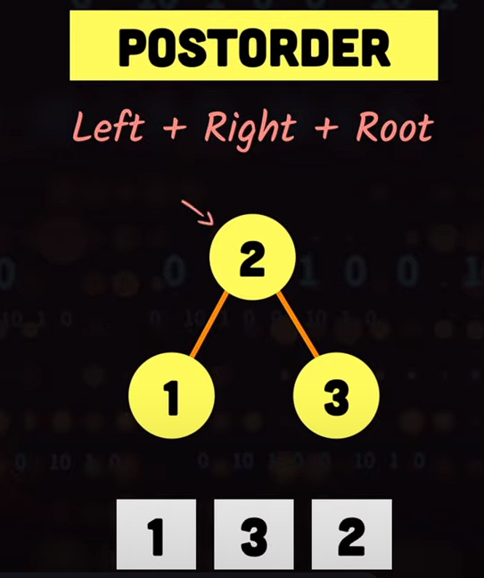

# Tree
Алгоритмы обхода BST деревьев (Также могут применяться и для обхода других деревьев)
https://www.youtube.com/watch?v=S2W3SXGPVyU

## Алгоритмы поиска в глубину depth-first search (DFS)

### In-Order
Обход по порядку. Идем:
1. Слева
2. В середину 
3. Направо \
 

### Pre-Order
Идем:
1. В середину
2. Влево
3. Направо \

### Post-Order
Идем:
1. Слева
2. Направо 
3. В середину \

## Алгоритм поиска в ширину breadth-first search (BFS)
https://www.youtube.com/watch?v=HZ5YTanv5QE

