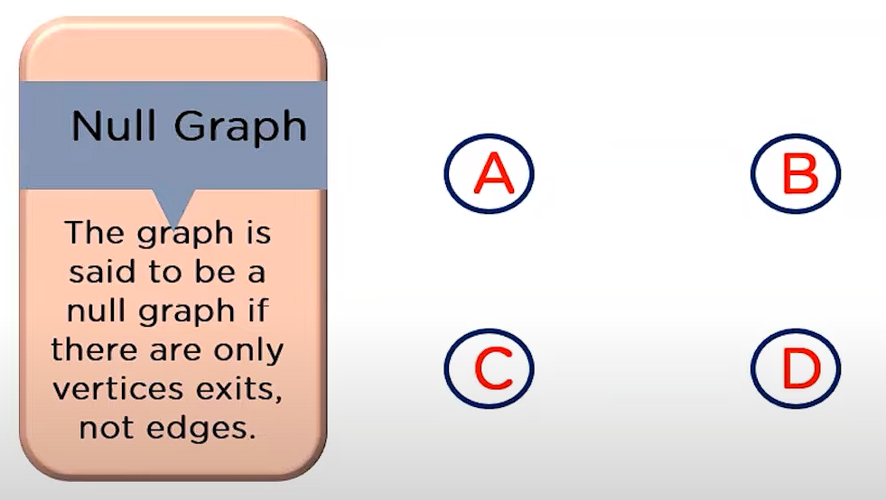
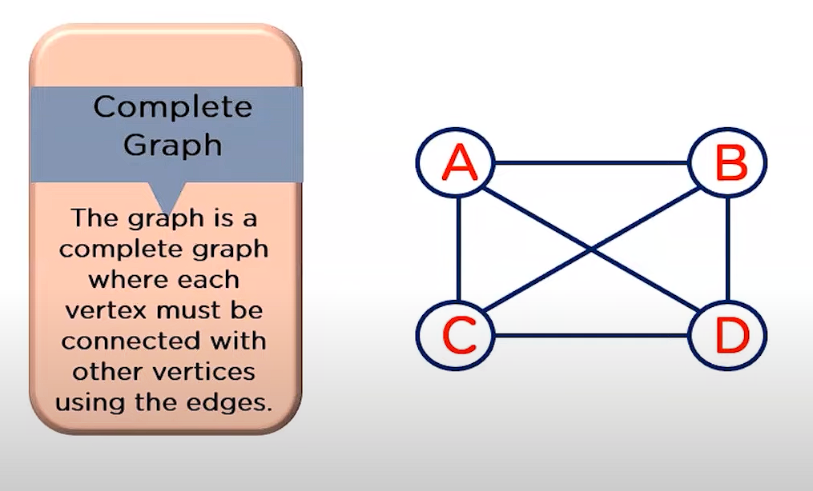
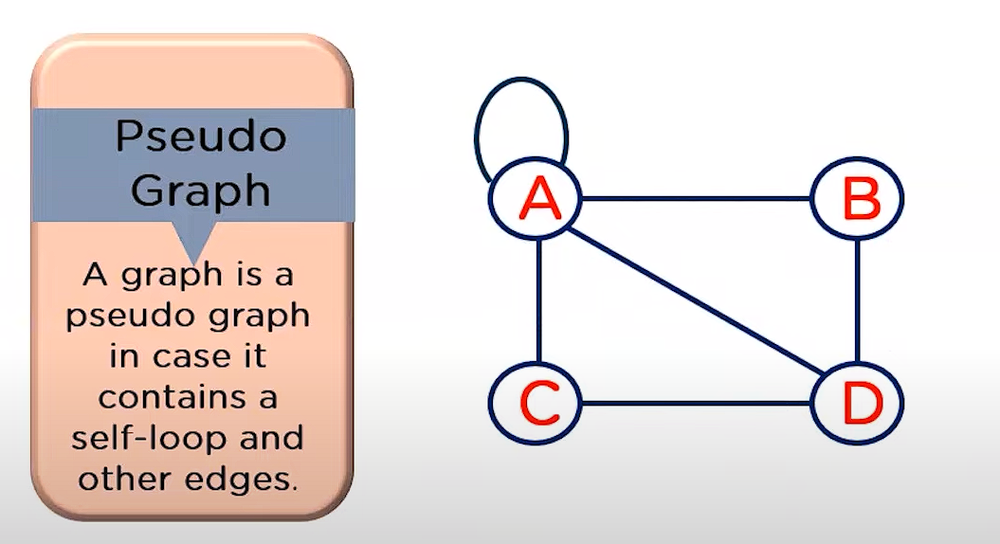
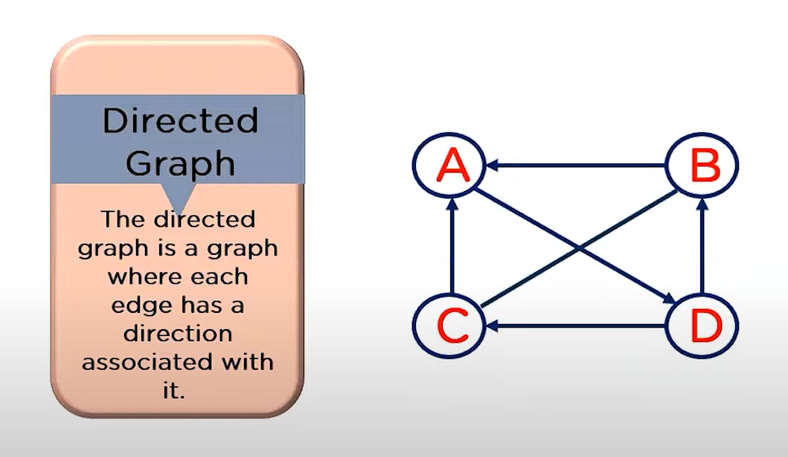
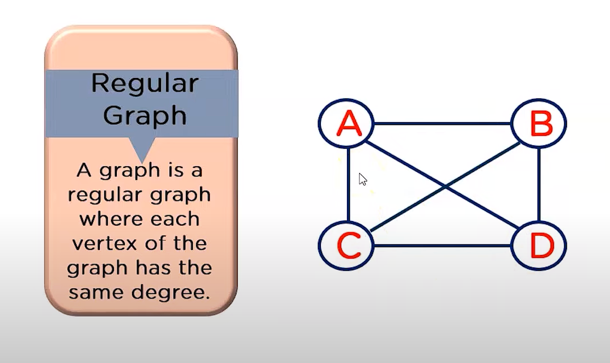
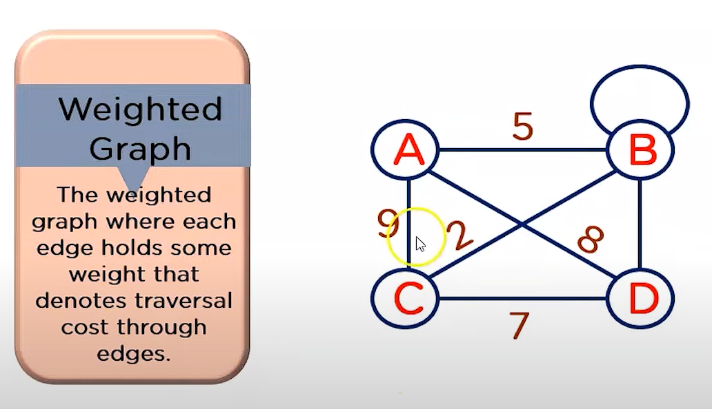
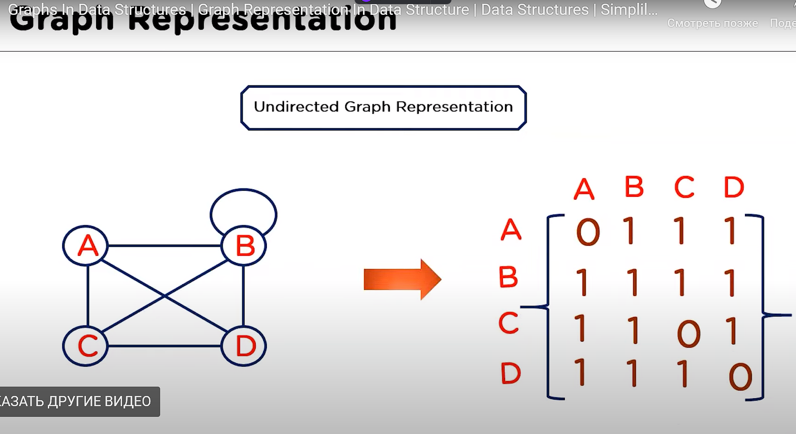
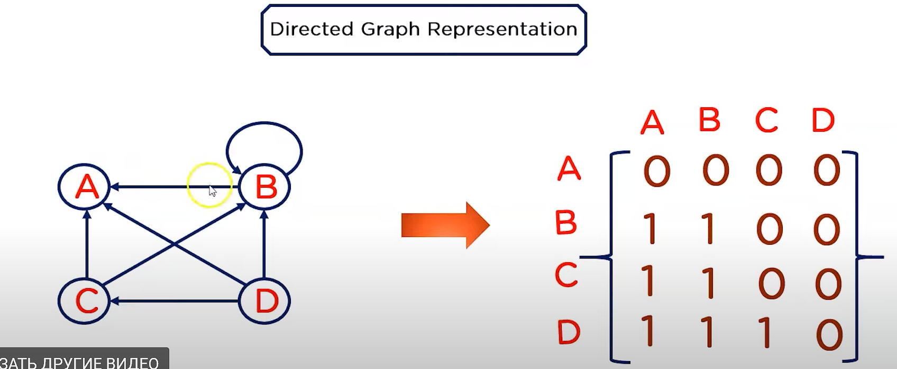
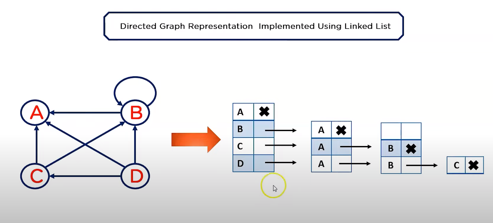

# Graph - Граф.

## Terminologies
1. Adjacent Vertices (Смежные Вершины) - Вершины соединенные одним ребром
2. Adjacent Edges (Смежные Ребра) - Если между двумя ребрами ровно одна вершина, то эти ребра смежные

3. Degree (Степень) - В неориентированном графе, число смежных вершин у вершины называется Degree (Степенью)
4. Path (Путь) - Последовательность вершин
5. Cycle (цикл)
6. Walk (Прогулка) - Последовательность перехода от одной вершины к другой

## Виды графов
1. Finite Graph (Конечный граф)
2. Infinite Graph (Бесконечный граф) - Бессчетный граф
3. Trivial Graph (Тривиальный граф) - Граф с одной вершиной
4. Simple Graph (Простой граф) - Между вершинами только одно ребро
5. Multi Graph (Мультиграф) - Граф с несколькими ребрами между вершинами
6. Null Graph (Нулевой) - Граф с вершинами без ребер
7. Complete Graph (Выполненный, полный) - Граф в котором все ребра соединены
8. Pseudo Graph (Псевдо-Граф) - Граф в котором, по крайней мере одна вершина имеет Cycle
9. Directed Graph (Ориентированный-Граф) - В графе ребра имеют определенную направленность
10. Regular Graph (Обычный-Граф) - В котором каждая вершина графа имеет одинаковую степень
11. Weighted Graph (Взвешенный-Граф) - В котором ребра имеют некоторый вес

## Представление графов
1. Adjacency Matrix (Матрица смежности)
   1. Ненаправленный
   2. Направленный
2. Adjacency List (Лист смежности)
   1. Направленный

## Обход графа
1. BFS algorith. Ищет ближайший первый узел
2. DFS algorith. Использует stack

## Где используются?
1. Веб-сайты (DOM-дерево?)
2. Соц.сети
3. и т.п.