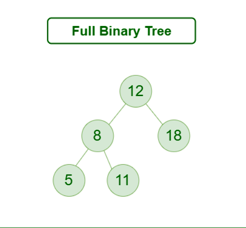
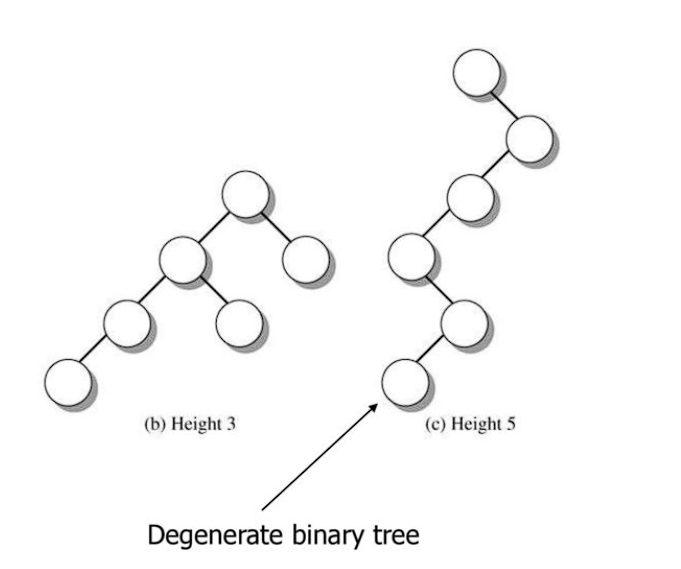
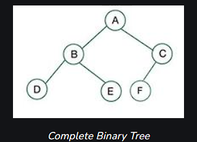
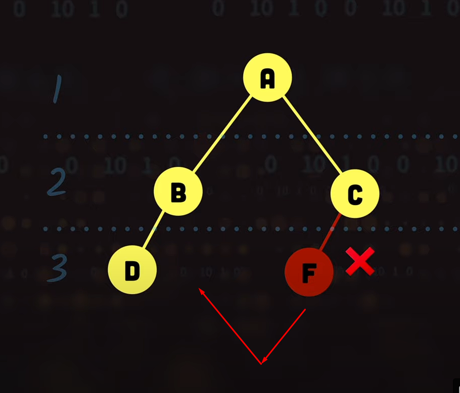
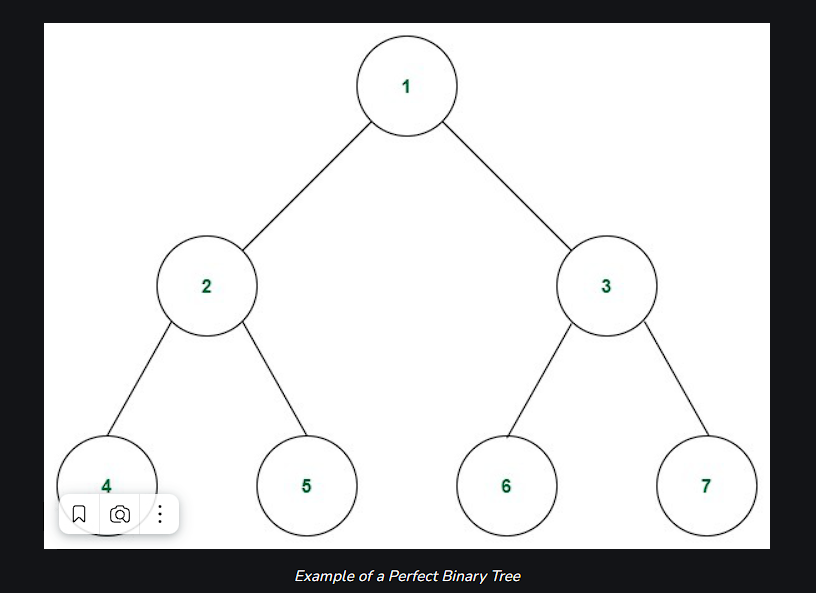
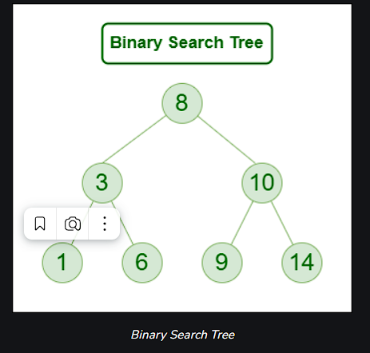
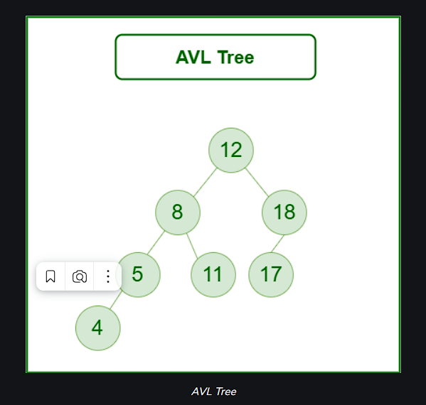
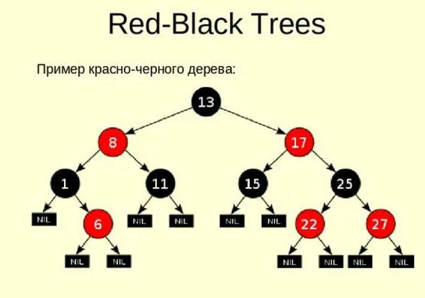

# Tree - Дерево.
 

## Структура данных в которой есть несколько основных элементов.
* Root (Parent Node) - Корень. Верхний и главный элемент
* Child Node - Нижестоящий элемент, какого-то элемента.
* Branches - Ветка дерева. Соединяет между собой Ноды.

## Где используется
* **File System**:  This allows for efficient navigation and organization of files.
* **Data Compression**: Huffman coding is a popular technique for data compression that involves constructing a binary tree where the leaves represent characters and their frequency of occurrence. The resulting tree is used to encode the data in a way that minimizes the amount of storage required.
* **Compiler Design**: In compiler design, a syntax tree is used to represent the structure of a program. 
* **Database Indexing**: B-trees and other tree structures are used in database indexing to efficiently search for and retrieve data. 

## Виды деревьев

1. #### Binary Tree. Бинарное дерево - у каждого элемент не более двух дочерних элементов.
   * Основанные на количестве дочерних элементов:
     1. Full BT. 
        1. У каждого элемента СТРОГО два дочерних
     2. Degenerate or Pathological BT. 
        1. У каждого элемента только один дочерний
   * Основанные на количестве уровней:
     1. Complete BT. 
        1. Одинаковая глубина листьев, кроме последнего
        2. Не полное
     2. Perfect BT. 
        1. Одинаковая глубина, одинаковое кол-во дочерних элементов у всех элементов.
     3. Balanced BT. 
        1. Разница между длинной левого и правого узла не должна быть более, чем в 1 элемент
   * Основанные на значение узлов
     1. Binary Search Tree (BST)
        * 
        * Левые элементы дерева содержат значения меньшие, чем правые
        * Правые элементы дерева содержат значения большие, чем левые
        * Правые и левые поддеревья тоже должны быть BST
     2. AVL Tree
        * 
        * Самобалансирующееся BT.
        * Разница между высотами правого и левого поддерева не может быть больше 1
     3. Red-Black Tree
        * 
        * Самобалансирующееся BT.
        * Первый (Корневой) элемент всегда черный
        * Остальные элементы всегда или черные, или красные
        * Если элемент красный, то его дочерний элемент черный
        * Все пути от элемента, до нуля - содержат одинаковое кол-во черных элементов
        * Есть 4 сценария работы с элементами.
          * [Ссылка](https://www.youtube.com/watch?v=5IBxA-bZZH8&list=PL9xmBV_5YoZNqDI8qfOZgzbqahCUmUEin&index=3) 